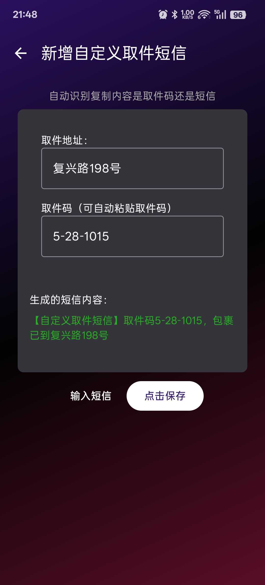

# Parcel - 取件码

这是一个免费、开源、无广告、不联网，追求简洁的app，不收集任何个人信息。

本app会自动解析收到的短信，并从中提取出地址和取件码信息，可以展示到桌面卡片上（支持暗色模式）。

您可以添加自定义规则来改进解析效果。

桌面卡片添加：一般是藏在全部卡片-最底部的插件或者安卓小组件里面

欢迎下载和使用！有问题或建议请提issue。

# 下载 | Download  

最新版本：v1.0.21

[Android apk release](https://github.com/shareven/parcel/releases/)

# 使用问题
	
1. 桌面卡片添加: 一般藏在全部卡片-最底部的插件或者安卓小组件里面
	
2. 小米手机要打开通知类短信权限【权限管理→其他权限→通知类短信→始终允许】
	
3. 如果发现有快递短信无法识别，并且是没有发送者号码的这种。这种短信目前识别不了，只能设置不接收这种短信。去短信设置里关闭 [服务信息]或者[5G信息] : 通过移动数据或者WLAN接收商家信息。
	
4. 如果出现桌面卡片不更新的情况，可能是后台进程被杀了，尝试在耗电管理里设置 不限制应用的后台行为，然后重新添加桌面卡片
	
5. 不发短信的话，可以复制取件码或短信，点击+号自动粘贴导入。也可以在菜鸟APP打开长辈模式，没啥广告

6. 如果github下载不了，请到微云下载[https://share.weiyun.com/6NipcuLD](https://share.weiyun.com/6NipcuLD)

# app展示

