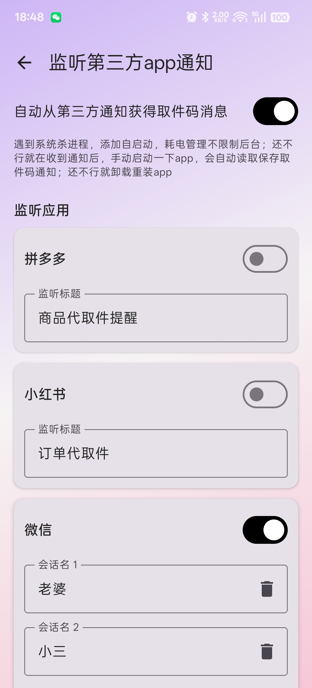

# 📦 Parcel - 取件码

---

这是一个免费、开源、无广告、不联网，追求简洁的app，不收集任何个人信息。

本app会自动解析收到的短信，并从中提取出地址和取件码信息，可以展示到桌面卡片上（支持暗色模式）。

您可以添加自定义规则来改进解析效果。

✅ 支持淘宝身份码和拼多多身份码

🔔 还支持监听第三方app通知，自动保存取件码消息，帮微信朋友取快递更方便了

⚡ 打开监听通知权限，还能实现后台进程保活，实时更新桌面卡片。

🏷️ 支持地址归类，把多个地址加入同一地址标签，方便查看

📱 桌面卡片添加：一般是藏在全部卡片-最底部的插件或者安卓小组件里面

 欢迎下载和使用！有问题或建议请提issue。

---

# 📲 下载 | Download

> 最新版本：v1.0.47

| 渠道 | 链接 |
|------|------|
| GitHub | [Android APK](https://github.com/shareven/parcel/releases/) |
| F-Droid |  |
| 下载统计 |  |

---

# ❓ 使用问题

1. **桌面卡片添加**
   > 一般藏在全部卡片-最底部的插件或者安卓小组件里面

2. **小米手机权限**
   > 要打开通知类短信权限【权限管理→其他权限→通知类短信→始终允许】

3. **无法识别的短信**
   > 如果发现有快递短信无法识别，并且是没有发送者号码的这种。这种短信目前识别不了：
   > - 第一种办法：设置不接收这种短信。去短信设置里关闭 **[服务信息]** 或者 **[5G信息]** : 通过移动数据或者WLAN接收商家信息
   > - 第二种办法：开启监听第三方app功能，设置并监听网络短信通知，自动保存通知里的取件码信息到自定义取件短信

4. **桌面卡片不更新**
   > 可能是后台进程被杀了，尝试打开监听通知权限，有助于实现后台进程保活，实时更新桌面卡片。在耗电管理里设置 **不限制应用的后台行为**，然后重新添加桌面卡片

5. **没有收到短信**
   > 不发短信的话，可以复制取件码或短信，点击 **+号** 自动粘贴导入。或者找快递客服，让他把取件码通知方式改成短信通知

6. **下载困难**
   > 如果github下载不了，请到微云下载 [https://share.weiyun.com/6NipcuLD](https://share.weiyun.com/6NipcuLD)

---

# 📱 App展示

---

**感谢使用！** 🙏

