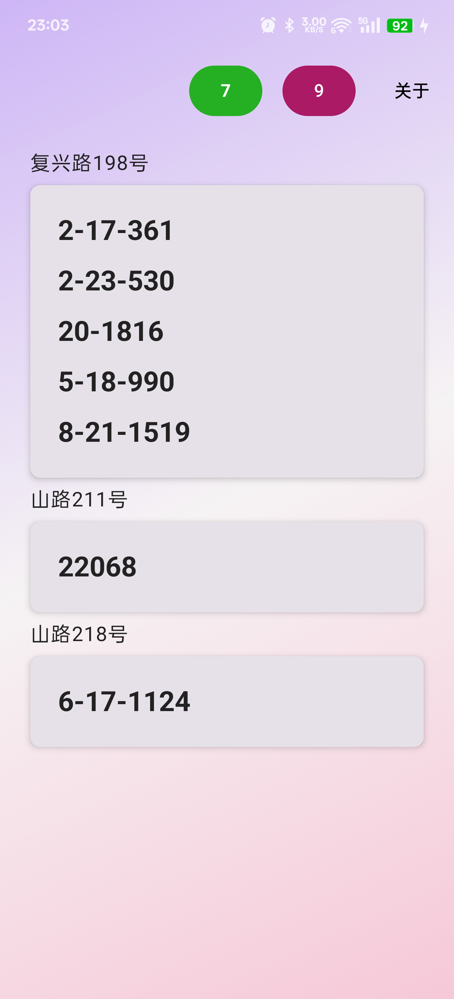

# Parcel - 取件码

这是一个免费、开源、无广告、不联网，追求简洁的app，不收集任何个人信息。

本app会自动解析收到的短信，并从中提取出地址和取件码信息，可以展示到桌面卡片上（支持暗色模式）。

您可以添加自定义规则来改进解析效果。

桌面卡片添加：一般是藏在插件或者安卓小组件里面

欢迎下载和使用！有问题或建议请提issue。

# 下载 | Download  

最新版本：v1.0.13

[Android apk release](https://github.com/shareven/parcel/releases/)

# app展示

